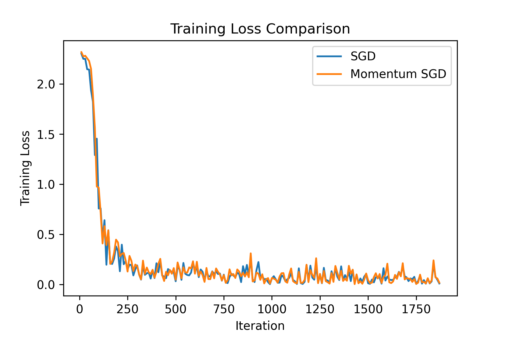

# SGD and Momentum SGD
Experimental Study of SGD and Momentum SGD

## 作业描述
在课程中，我们讨论了 momentum SGD 等价于学习率增大后的标准 SGD 算法，参见 Lecture 8 的Slides. 请在如下任务中对比学习率为 gamma 的momentum SGD以及学习率为gamma/(1-beta) 的 standard SGD 的 training loss 曲线与 test accuracy 曲线，其中 beta 为动量系数。以上两种优化算法均需要自行编写。
+ [1] 在实际数据集(可在 LIBSVM [R1-2]中自行挑选)中做线性回归任务，对两种算法的结果进行对比与分析
+ [2] 在 MNIST 数据集中训练 LeNet 神经网络，对两种算法的结果进行对比分析
+ [3] 在 CIFAR10 的数据集中训练 Resnet-18 神经网络，对两种算法结果进行对比
+ [4] 在 MNIST 的数据集中测试不同的 constant learning rate 对 SGD 的收敛曲线及 test accuracy 的影响
+ [5] 在 MNIST 的数据集中测试不同的 batch-size 对 SGD 的收敛曲线及 test accuracy 的影响

## 任务分工
+ 陈：[1]
+ 赵：[2][4][5]
+ 朱：[3]

## 实验结果
设 $\gamma_s$ 为标准SGD的学习率， $\gamma_m$ 为Momentum SGD的学习率， $\beta$ 为动量系数。我们取 $\gamma_s$ 满足

$$
    \gamma_s = \frac{\gamma_m}{1 - \beta}
$$

以下报告各种batch_size、$\gamma_m$、$\beta$设定下，SGD与Momentum SGD的对比结果。
### MNIST数据集上训练LeNet神经网络
#### 变化学习率
batch_size=64, $\gamma_m=0.001$, $\beta=0.9$

batch_size=64, $\gamma_m=0.005$, $\beta=0.9$

batch_size=64, $\gamma_m=0.01$, $\beta=0.9$

#### 变化batch_size
